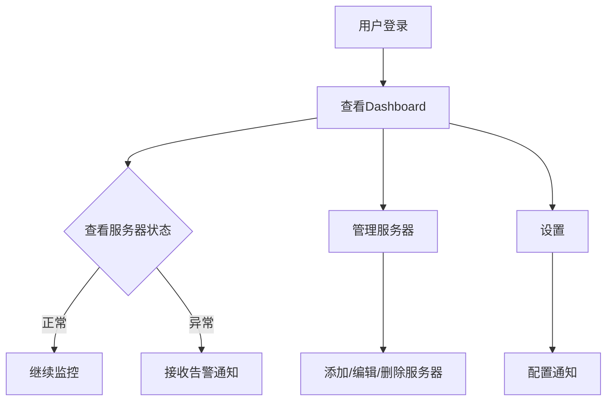

## 1. Product Overview
一个类似哪吒探针/uptimekuma的服务器监测面板，用于实时监控服务器状态、响应时间和可用性。
- 核心功能：服务器状态监控、响应时间追踪、告警通知、历史数据统计
- 目标用户：开发者、运维人员、系统管理员
- 市场价值：提供简单易用的服务器监控解决方案，帮助用户及时发现和解决服务器问题

## 2. Core Features

### 2.1 User Roles
| Role | Registration Method | Core Permissions |
|------|---------------------|------------------|
| Admin | Email registration | Full access to all features |
| User | Email registration | View and manage assigned servers |

### 2.2 Feature Module
1. **Dashboard**: 实时状态概览、服务器卡片展示、统计图表
2. **Servers Management**: 添加/编辑/删除服务器、配置监控参数
3. **Settings**: 用户配置、通知设置、系统参数

### 2.3 Page Details
| Page Name | Module Name | Feature description |
|-----------|-------------|---------------------|
| Dashboard | Overview | 显示所有服务器状态摘要、在线率统计 |
| Dashboard | Server Cards | 展示各服务器状态、响应时间、最后检查时间 |
| Dashboard | Charts | 响应时间趋势图、可用性统计图表 |
| Servers | Server List | 服务器列表管理、搜索筛选 |
| Servers | Add Server | 添加新服务器表单 |
| Servers | Edit Server | 编辑服务器配置 |
| Settings | Profile | 用户个人信息管理 |
| Settings | Notifications | 告警通知配置（邮件、Webhook） |

## 3. Core Process
用户登录 → 查看Dashboard概览 → 管理服务器 → 配置通知 → 接收告警

## 4. User Interface Design

### 4.1 Design Style
- **主色调**: 淡蓝色 (#E0F4FF)
- **辅助色**: 薰衣草色 (#E6E6FA)
- **按钮风格**: 高圆角、玻璃液态效果 (Glassmorphism)
- **字体**: 现代无衬线字体，清晰易读
- **布局**: 卡片式布局，响应式设计
- **图标**: 简洁现代风格

### 4.2 Page Design Overview
| Page Name | Module Name | UI Elements |
|-----------|-------------|-------------|
| Dashboard | Sidebar | 导航菜单、Logo、用户信息 |
| Dashboard | Header | 标题、搜索框、通知按钮 |
| Dashboard | Overview Cards | 统计卡片，玻璃液态效果 |
| Dashboard | Server List | 服务器卡片网格，高圆角设计 |
| Dashboard | Charts | 响应时间趋势图表 |
| Servers | Modal | 弹窗式服务器添加/编辑表单 |
| Settings | Tabs | 设置项分类标签 |

### 4.3 Responsiveness
- Desktop-first设计，支持响应式布局
- 移动端自适应：侧边栏折叠、卡片堆叠显示
- 触摸优化：按钮尺寸适合触摸操作

### 4.4 UI特性
- 玻璃液态效果：背景模糊、半透明卡片
- 高圆角：按钮和卡片使用大圆角
- 弹窗选择：所有选择按钮使用页面内弹窗形式
- 平滑过渡动画：页面切换、卡片悬停效果