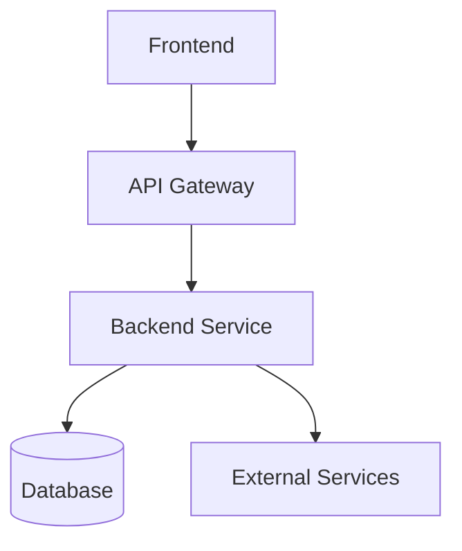
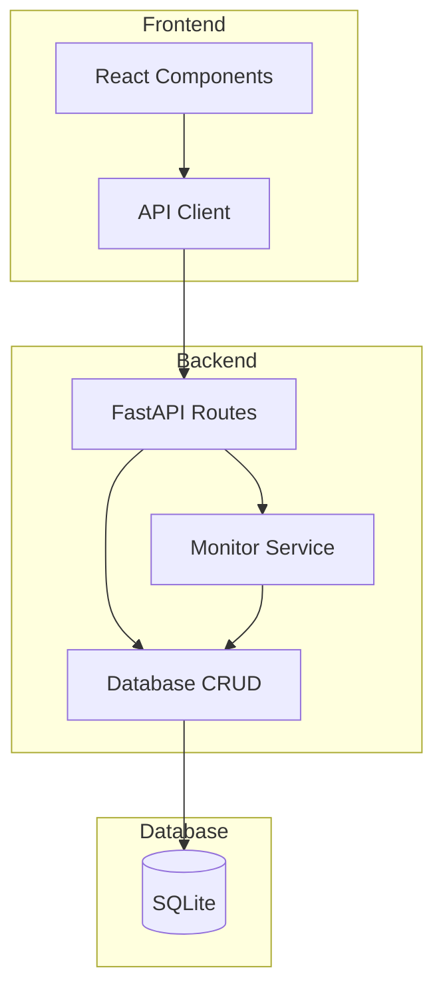
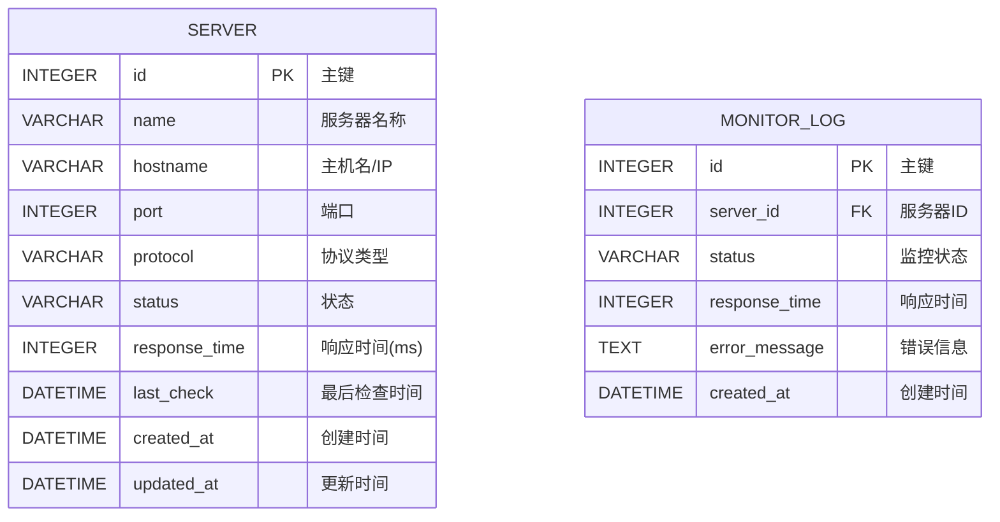

## 1. Architecture Design


## 2. Technology Description
- Frontend: React@18 + tailwindcss@3 + vite
- Initialization Tool: vite-init
- Backend: Python + FastAPI@0.100 + Uvicorn
- Database: SQLite (轻量级，适合监控面板)
- Charting: Chart.js or Recharts

## 3. Route Definitions
| Route | Purpose |
|-------|---------|
| / | Dashboard首页 |
| /servers | 服务器管理页面 |
| /settings | 设置页面 |

## 4. API Definitions

### 4.1 Server Endpoints
| Method | Endpoint | Description |
|--------|----------|-------------|
| GET | /api/servers | 获取所有服务器列表 |
| GET | /api/servers/{id} | 获取单个服务器详情 |
| POST | /api/servers | 添加新服务器 |
| PUT | /api/servers/{id} | 更新服务器配置 |
| DELETE | /api/servers/{id} | 删除服务器 |

### 4.2 Server Schema
```typescript
interface Server {
  id: number;
  name: string;
  hostname: string;
  port: number;
  protocol: 'http' | 'https' | 'tcp';
  status: 'online' | 'offline' | 'pending';
  response_time: number;
  last_check: string;
  created_at: string;
  updated_at: string;
}
```

### 4.3 Monitor Endpoints
| Method | Endpoint | Description |
|--------|----------|-------------|
| GET | /api/monitor/status | 获取所有服务器监控状态 |
| GET | /api/monitor/history/{server_id} | 获取服务器历史监控数据 |

## 5. Server Architecture Diagram


## 6. Data Model

### 6.1 Data Model Definition


### 6.2 Data Definition Language
```sql
CREATE TABLE servers (
    id INTEGER PRIMARY KEY AUTOINCREMENT,
    name VARCHAR(100) NOT NULL,
    hostname VARCHAR(255) NOT NULL,
    port INTEGER NOT NULL DEFAULT 80,
    protocol VARCHAR(10) NOT NULL DEFAULT 'http',
    status VARCHAR(20) NOT NULL DEFAULT 'pending',
    response_time INTEGER DEFAULT 0,
    last_check DATETIME,
    created_at DATETIME NOT NULL DEFAULT CURRENT_TIMESTAMP,
    updated_at DATETIME NOT NULL DEFAULT CURRENT_TIMESTAMP
);

CREATE TABLE monitor_logs (
    id INTEGER PRIMARY KEY AUTOINCREMENT,
    server_id INTEGER NOT NULL,
    status VARCHAR(20) NOT NULL,
    response_time INTEGER DEFAULT 0,
    error_message TEXT,
    created_at DATETIME NOT NULL DEFAULT CURRENT_TIMESTAMP,
    FOREIGN KEY (server_id) REFERENCES servers(id) ON DELETE CASCADE
);

INSERT INTO servers (name, hostname, port, protocol) VALUES
('Localhost', '127.0.0.1', 80, 'http'),
('Example Server', 'example.com', 443, 'https');
```